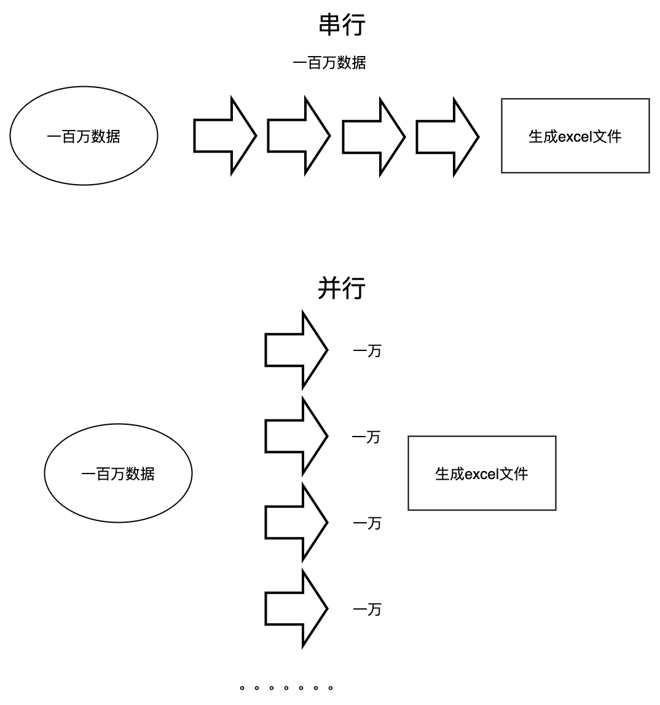
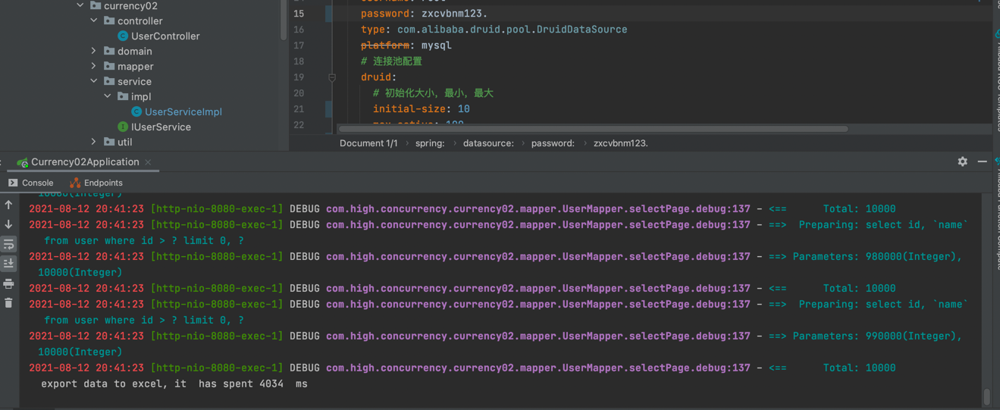

项目模拟一百万的数据导出，要求10s内实现全部数据导出,项目使用springboot + mysql + mybatis + poi。  
项目核心思想 数据分页 + 线程池  
采用线程池和数据分页的原因：在于数据导出涉及IO操作，不采用线程池的话，串行耗时较长，同时数据量较大，不对数据进行分页处理，可能会产生内存溢出。  

数据来源：[百万数据插入](https://github.com/zhouzhou98/high_concurrency)
####用户数据库：
```sql
CREATE TABLE `user` (
  `id` int(11) NOT NULL,
  `name` varchar(45) DEFAULT NULL,
  `createdTime` datetime DEFAULT CURRENT_TIMESTAMP ON UPDATE CURRENT_TIMESTAMP,
  `updatedTime` datetime DEFAULT CURRENT_TIMESTAMP ON UPDATE CURRENT_TIMESTAMP,
  PRIMARY KEY (`id`),
  KEY `index` (`id`)
) ENGINE=InnoDB DEFAULT CHARSET=utf8mb4 COMMENT='用户测试表';

```
线程池数据量的设计：[合理配置线程池数量](https://www.cnblogs.com/aimei/p/12195020.html)
由于数据导出涉及大量IO, 故线 程数量 = 2 * cpu核数
```java
 final int nThreads = Runtime.getRuntime().availableProcessors();
 ExecutorService pool = Executors.newFixedThreadPool(nThreads << 1);
```
同时，通过数据库查询语句添加where条件，减少数据深度分页带来的性能损耗问题
```xml
<select id="selectPage" resultType="com.high.concurrency.currency02.domain.User">
    select id, `name` from user where  id > #{param1} limit 0, #{param2}
</select>
```
除此之外，数据库的优化，地址：[MySQL核心参数优化](https://www.cnblogs.com/jenvid/p/8994831.html)  
```java
package com.high.concurrency.currency02.service.impl;

import com.high.concurrency.currency02.domain.User;
import com.high.concurrency.currency02.mapper.UserMapper;
import com.high.concurrency.currency02.service.IUserService;
import com.high.concurrency.currency02.util.ExcelUtil;
import com.high.concurrency.currency02.util.PageUtil;
import org.springframework.beans.factory.annotation.Autowired;
import org.springframework.stereotype.Service;

import java.util.List;
import java.util.concurrent.ExecutorService;
import java.util.concurrent.Executors;

@Service
public class UserServiceImpl implements IUserService {
    @Autowired
    private UserMapper userMapper;
    @Override
    public String exportData() {
        // 获取可用的线程数
        final int nThreads = Runtime.getRuntime().availableProcessors();
        ExecutorService pool = Executors.newFixedThreadPool(nThreads << 1);
        int pageSize = PageUtil.pageSize;
        // 获取数据总量
        Integer count = userMapper.getCount();
        // 获取总页数
        int totalPageCount= PageUtil.getTotalPageCount(count);
        // 开始统计时间
        long start=System.currentTimeMillis();
        int maxId = 0;
        for(int currentPageNum = 0; currentPageNum < totalPageCount; currentPageNum++) {
            List<User> userList = userMapper.selectPage(maxId, pageSize);
            maxId = userList.get(userList.size() - 1).getId();
            int finalCurrentPageNum = currentPageNum;

            Runnable run = new Runnable() {
                @Override
                public void run() {
                    ExcelUtil.createExcel(finalCurrentPageNum, userList);
                    if(finalCurrentPageNum == (totalPageCount-1)){
                        System.out.println("  export data to excel, it  has spent " +(System.currentTimeMillis()-start)+"  ms");
                    }
                }
            };
            pool.execute(run);
        }
        return "ok";
    }
}
```
操作效果如下：  

